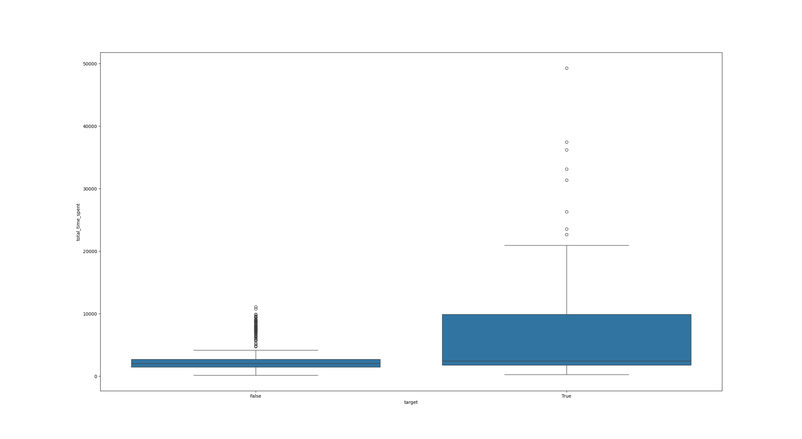
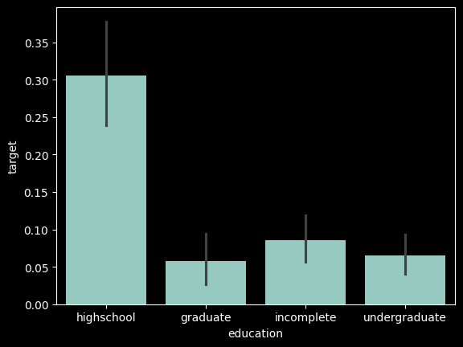
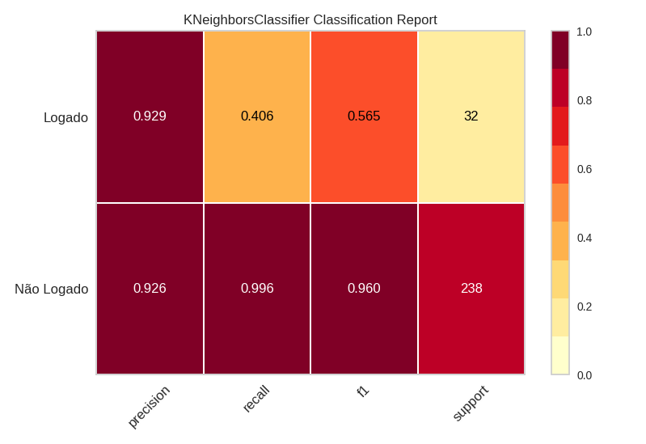
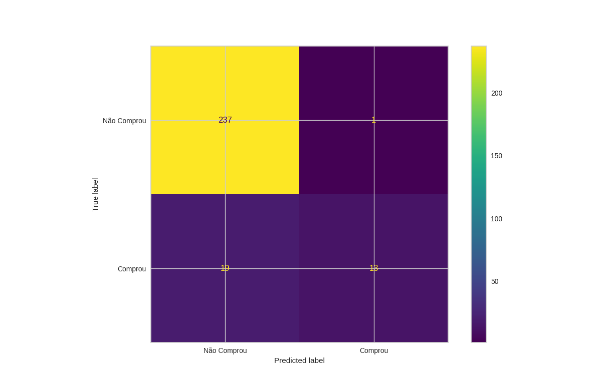
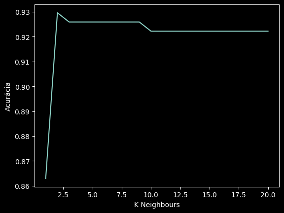

# Análise de conversão

## Análises de correlação

| Baxplot de tempo gasto                            | Distribuição de vendas por educação            |
| ------------------------------------------------- | ---------------------------------------------- |
|  |  |

## Métricas iniciais de performance

| Relatório de Classificação                                | Matriz de Confusão                              | Avaliação de Vizinhos               |
| --------------------------------------------------------- | ----------------------------------------------- | ----------------------------------- |
|  |  |  |
