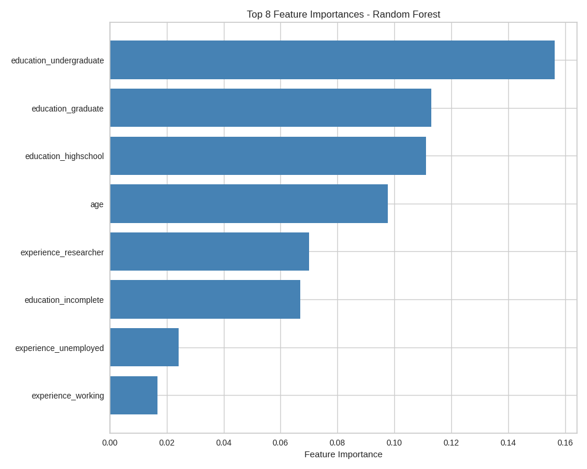
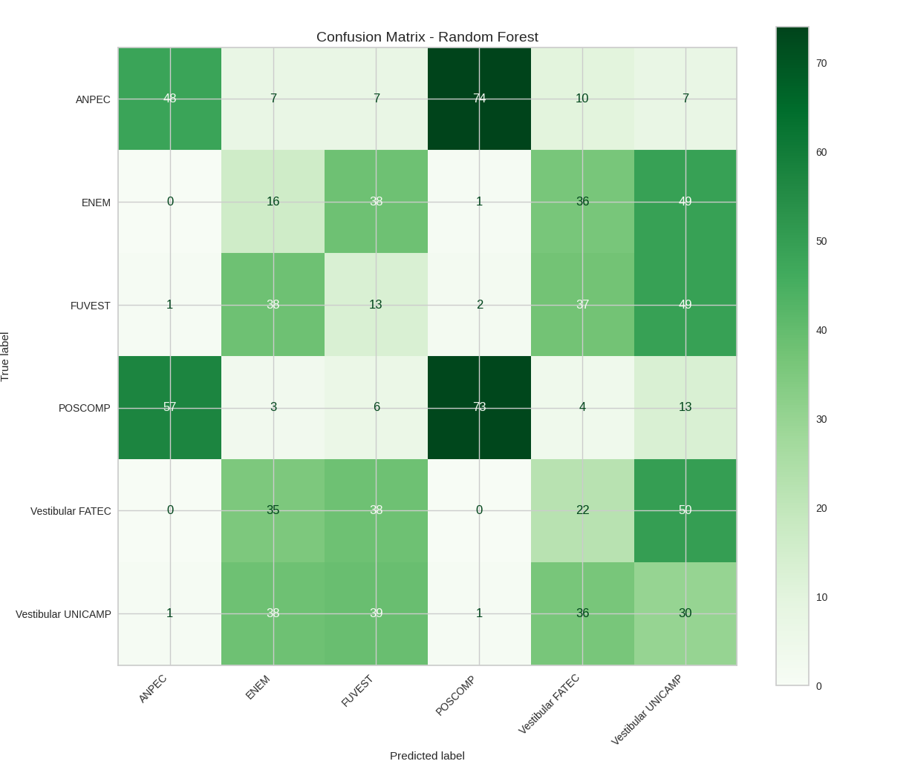

# Modelo de recomendação de trilhas

Um dos modelos de rendimento do sistema são trilhas de estudo para vestibulares e outras provas baseados no perfil do usuário.

## Métricas e Performance

| Importância de Features                                  | Matriz de confusão                                |
| -------------------------------------------------------- | ------------------------------------------------- |
|  |  |

## Melhorias Futuras

- [ ] Mesclar dados de navegação em busca de novas features
- [ ] Testar com uma maior massa de dados
