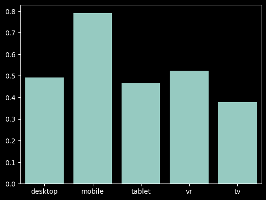
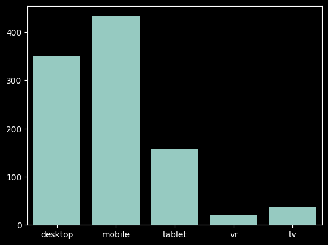
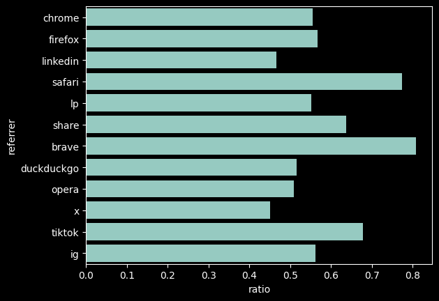
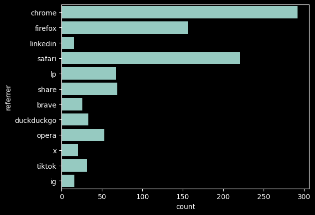
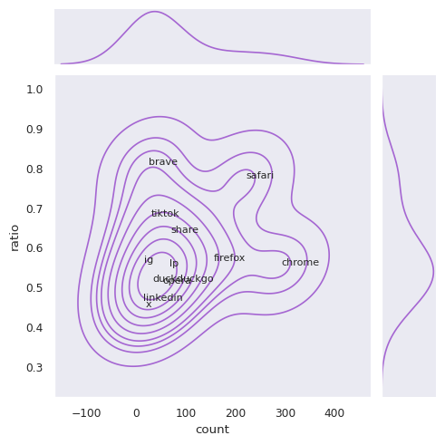

# Análise de sign in

## Datasets

### Dados brutos

| ip          | date       | email | route         | scroll_pct | time_spent | referrer | device  |
| ----------- | ---------- | ----- | ------------- | ---------- | ---------- | -------- | ------- |
| 8.8.194.182 | 20/01/2027 |       | /instituicoes | 75.42      | 191        | chrome   | desktop |

### Preprocessamento

| target | scroll_pct | time_spent | referrer_share | referrer\_... | device_mobile | device\_... | route\_/cursos | route\_/... | month_1 | month\_... |
| ------ | ---------- | ---------- | -------------- | ------------- | ------------- | ----------- | -------------- | ----------- | ------- | ---------- |
| 0      | 0.7542     | 0.5177     | 0.0            | 1.0           | 0.0           | 1.0         | 1.0            | 0.0         | 1.0     | 0.0        |

## Usos para o negócio

1. Modelo de decisão pode ser implantado em microserviço de API em Python para avaliar sessões de usuários e acionar notificações no frontend. Exemplos: brilho ou mensagem apontando para o link de cadastro, sugestão de features que requerem autenticação, como favoritar conteúdo.
2. Correlações identificadas podem ser usadas para refinar a interface e guiar usuários para rotas que o inclinam a se cadastrar.

### Correlações identificadas

| Signups por dispositivo                              | Proporção de dispositivos                           |
| ---------------------------------------------------- | --------------------------------------------------- |
|  |  |

| Signups por _referrer_                              | Proporção de _referrers_                           | User Base x % de cadastros                   |
| --------------------------------------------------- | -------------------------------------------------- | -------------------------------------------- |
|  |  |  |

### API de sugestão

```py
# TODO: código de FastAPI
# Carregar modelo com pickle
# Instanciar OneHot e MinMax scalers
# Transformar e processar input
# Enviar sugestão
```
